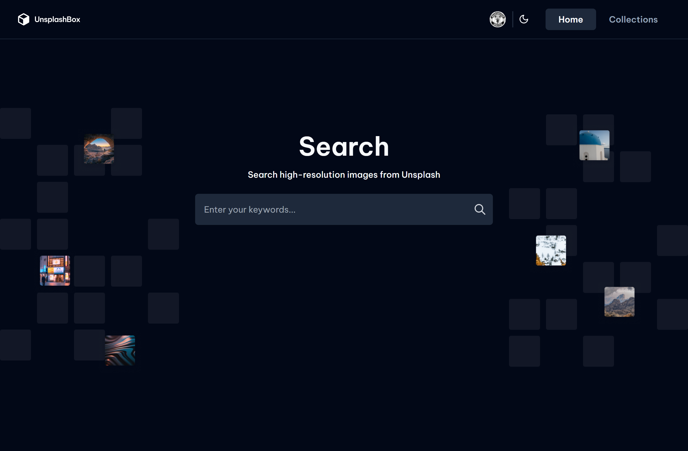
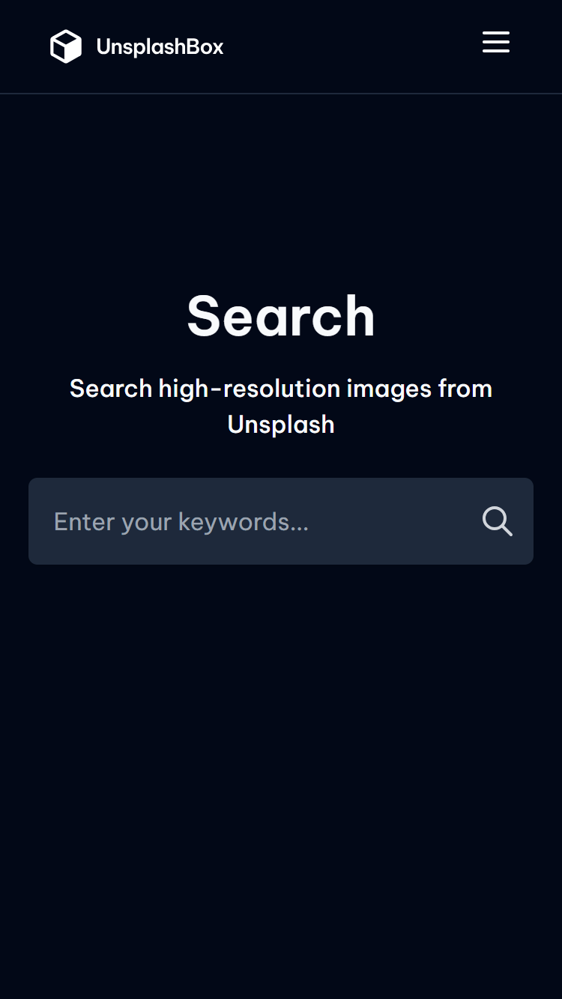

# Unsplash Collection

## Table of contents

- [Overview](#overview)
  - [The features](#the-features)
  - [Screenshot](#screenshot)
  - [Links](#links)
- [My process](#my-process)
  - [Built with](#built-with)
- [Author](#author)

## Overview

### Features

Users should be able to:

- Create a multiple-page website following the given design.
- On Homepage, users can search for images from Unsplash given keywords.
- On Homepage, when user press `Enter`, a list of images should be shown as a result if at least a keyword is provided.
- Users can select an image and see its details in a separate Image page.
- On Image page, users can see the author and published date.
- On Image page, users can see a list of collections that the image belongs to.
- On Image page, users can choose to add the image to a collection by selecting `Add to Collection` button
- When `Add to Collection` button is selected, users can search and add images to searched - collections. The collection search result should only show collections that the image does not yet belong to.
- On Image page, users can remove the image from its collections.
- On Image page, users can download the image.
- On Collections page, users can see and select existing collections.
- On Collections page, when a collection is selected, users can see a list of images in the - collection.

### Screenshots

### Links

- Solution URL: [https://github.com/leoikeh99/unsplash-collection](https://github.com/leoikeh99/unsplash-collection)
- Live Site URL: [https://unsplash-collection-taupe.vercel.app](https://unsplash-collection-taupe.vercel.app)

## My process

### Built with

- Semantic HTML5 markup
- CSS custom properties
- Flexbox
- CSS Grid
- Mobile-first workflow
- [React](https://reactjs.org/) - JS library
- [Next.js](https://nextjs.org/) - React framework
- [Tailwind CSS](https://tailwindcss.com/) - For styles
- [Shadcn UI](https://ui.shadcn.com/) - Some UI components
- [React Query](https://react-query.tanstack.com/) - For data management
- [NextAuth](https://next-auth.js.org/) - For authentication
- [Prisma](https://prisma.io/) - ORM
- [MongoDB](https://mongobd.com/) - Database

## Author

- Website - [Leonard Ikeh](https://leonardikeh.netlify.app/)
- Linkedin - [@leonard](https://www.linkedin.com/in/leonard-ikeh-22367a209/)
- Twitter - [@wazza_dev](https://www.twitter.com/wazza_dev)
